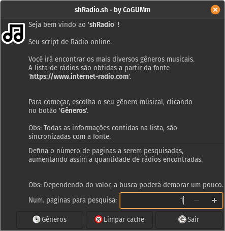

<h1>Ouça rádios on-line pelo seu terminal!</h1>

<h1 align="center">
    
</h1>

<p align="center">
  

  

  <a href="https://github.com/cogumm/shRadio/commits/master">
    
  </a>

  
   <a href="https://github.com/cogumm/shRadio/stargazers">
    
  </a>
</p>

<p align="center">
  <a href="#information_source-o-que-é-o-projeto-">O que é o projeto ?</a>&nbsp;&nbsp;&nbsp;|&nbsp;&nbsp;&nbsp;
  <a href="#-como-contribuir">Como contribuir</a>&nbsp;&nbsp;&nbsp;|&nbsp;&nbsp;&nbsp;
  <a href="#memo-license">License</a>
</p>

## :information_source: O que é o projeto ?

O projeto nasceu de uma simples vontade de brincar com bash/shell script para ouvir rário on-line.

### Utilização

Só realizar os sequintes passos:

```bash
# 1. Clonando o repositório.
$ git clone https://github.com/cogumm/shRadio.git

# 2. Acessando o diretório do projeto.
$ cd 'shRadio'

# Rodando o programa.
$ bash shRadio.sh
```

## 🤔 Como contribuir

-   Realize um fork;
-   Crie uma branch: `git checkout -b my-feature`;
-   Envie suas mudanças: `git commit -m 'feat: My new feature'`;
-   Faça um push da sua branch: `git push origin my-feature`.

Depois que a sua solicitação de recebimento for feita o merging, você pode excluir a sua branch.

## :memo: License

Este projeto está sob licença MIT, para mais detalhes verifique em [LICENSE][license]!

Made with ♥ by Gabriel F. Vilar :wave: [Telegram][telegram]

[license]: https://cogumm.mit-license.org/
[telegram]: https://t.me/CoGUMm
